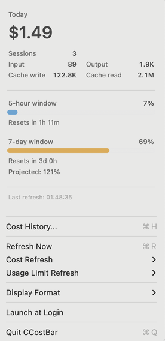
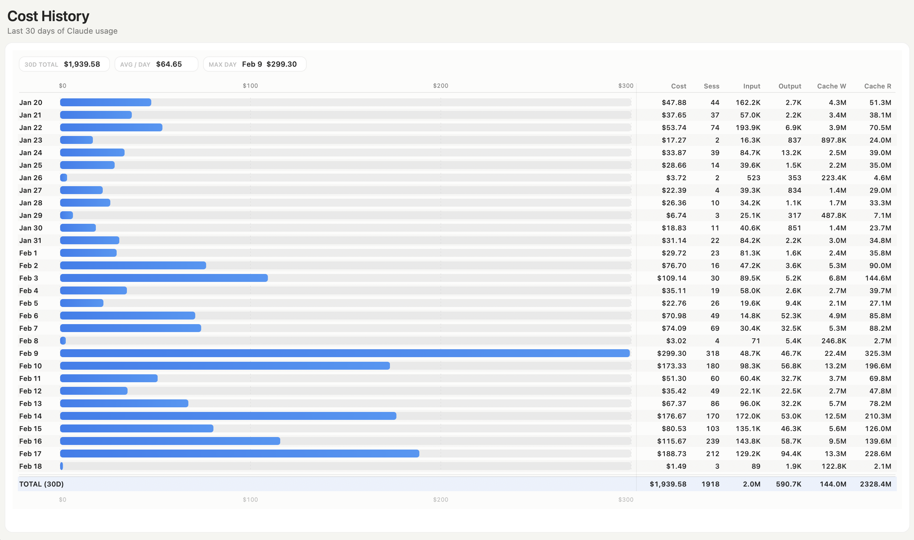

# CCost

Fast Claude usage and cost tracking for macOS.

CCost includes:
- A native menu bar app (`CCostBar`) for live daily spend and rate-limit visibility.
- A CLI (`ccost-cli`) for querying usage history and exporting JSON.
- A shared parser/cache library (`CCostLib`) that scans local Claude logs and computes daily totals.

## Screenshots




## Features

- Parses local Claude session JSONL logs from `~/.claude/projects`.
- Calculates daily cost using per-model token pricing.
- Tracks input/output/cache token usage and distinct session counts.
- Incremental cache backed by SQLite for fast repeat runs.
- Native macOS status bar app with:
  - Current day spend.
  - 5-hour and 7-day utilization.
  - Configurable refresh intervals.
  - 30-day cost history window.
  - Launch-at-login support.
- CLI filters (`--since`, `--until`, `--project`) and JSON output.

## Requirements

- macOS 14+ (per `Package.swift`).
- Swift 5.10 toolchain (Xcode Command Line Tools or Xcode).
- No separate SQLite install is required on macOS; CCost links against the system `sqlite3` library.
- Local Claude Code logs under `~/.claude/projects`.
- For rate-limit data in the menu app:
  - A keychain item named `Claude Code-credentials` containing Claude OAuth JSON.

## Quick Start

```bash
git clone https://github.com/brennancheung/ccost.git
cd ccost/app
./build.sh
open .build/release/CCostBar.app
```

## Canonical Build and Relaunch Flow

Use `build.sh` for packaging and relaunching the menu app bundle.

```bash
pkill -f CCostBar || true
cd /path/to/ccost/app
./build.sh
open .build/release/CCostBar.app
pgrep -fl CCostBar
```

Do not use plain `swift build` as the final relaunch path for the app bundle.

## CLI Usage

From `/path/to/ccost/app`:

```bash
swift run ccost-cli --help
```

Basic command:

```bash
swift run ccost-cli [options]
```

Options:
- `--since <date>`: `YYYYMMDD` or `YYYY-MM-DD`
- `--until <date>`: `YYYYMMDD` or `YYYY-MM-DD`
- `--project <name>`: partial project match (`LIKE %name%` on project directory id)
- `--json`: machine-readable output
- `--rebuild`: clear and rebuild cache

Date filter semantics:
- `--since` and `--until` are inclusive.
- Dates are normalized to `YYYY-MM-DD` internally.

What the CLI does each run:
1. Scans `~/.claude/projects/**/*.jsonl`.
2. Diffs files against cache by `mtime` + file size.
3. Parses only added/changed files.
4. Deduplicates messages by `message.id + requestId`.
5. Aggregates usage by local date + model, then computes cost.
6. Persists results to SQLite cache and prints table/JSON output.

Cache behavior:
- Default: incremental and fast after first run.
- `--rebuild`: clears cached file and usage tables, then reparses all files.

Output formats:
- Default table columns: `Date`, `Input`, `Output`, `Cache W`, `Cache R`, `Cost`, `Sessions`.
- Includes a `TOTAL` row and cache/processing timing stats.
- `--json` returns an array of daily objects:
  - `date`
  - `cost`
  - `inputTokens`
  - `outputTokens`
  - `cacheCreationInputTokens`
  - `cacheReadInputTokens`
  - `sessions`

Model pricing notes:
- Unknown Claude models fall back to Sonnet pricing.
- Unknown model warnings are printed to `stderr`.

Examples:

```bash
# All available history
swift run ccost-cli

# Inclusive date range
swift run ccost-cli --since 2026-02-01 --until 2026-02-18

# Project-scoped JSON
swift run ccost-cli --project my-repo --json

# Force a full reparse
swift run ccost-cli --rebuild

# Last 7 days (shell example)
swift run ccost-cli --since "$(date -v-6d +%Y-%m-%d)" --until "$(date +%Y-%m-%d)"
```

## Data Sources and Storage

Input logs:
- `~/.claude/projects/**/*.jsonl`

Cache and pricing:
- `~/.cache/ccost/cache.db`
- `~/.cache/ccost/pricing.json` (optional pricing overrides)

The parser deduplicates entries by `message.id + requestId`, aggregates by local day and model, then computes cost.

## Pricing Model

Built-in Claude pricing exists in `CCostLib/Pricing.swift`.

Unknown models:
- Fallback to Sonnet pricing.
- CLI prints warnings for unknown models.

Optional override file:
- Place JSON at `~/.cache/ccost/pricing.json`.
- Keys are model names; values are per-million token rates.

## Rate-Limit Integration

The menu app calls:
- `GET https://api.anthropic.com/api/oauth/usage`

Auth source:
- OAuth access token read from keychain item `Claude Code-credentials`.

If missing/invalid, CCost still runs cost tracking but shows a rate-limit error in the menu UI.

## Project Layout

```text
ccost/
  README.md
  LICENSE
  AGENTS.md
  app/
    Package.swift
    build.sh
    Sources/
      CCostLib/    # scanner, parser, database, pricing, formatting
      ccost-cli/   # CLI entrypoint
      CCostBar/    # native macOS menu bar app
```

## Development Notes

- `CCostBar` is an `LSUIElement` app (menu bar utility).
- User preferences (refresh intervals, display format, launch-at-login) use `UserDefaults`.
- History window supports `Cmd+W` to close.

## Troubleshooting

No usage data found:
- Confirm Claude logs exist in `~/.claude/projects`.
- Run `swift run ccost-cli --rebuild`.

Rate limits not loading:
- Verify keychain entry:
  - `security find-generic-password -s "Claude Code-credentials" -w`
- Ensure the stored JSON includes `claudeAiOauth.accessToken`.

App relaunch did not pick up changes:
- Use the canonical kill/rebuild/relaunch flow above.
- Confirm process path with `pgrep -fl CCostBar`.

## Contributing

Issues and PRs are welcome.

Recommended local checks before opening a PR:

```bash
cd /path/to/ccost/app
./build.sh
swift run ccost-cli --since 2026-01-01 --until 2026-01-07 --json
```

## License

MIT. See `LICENSE`.
